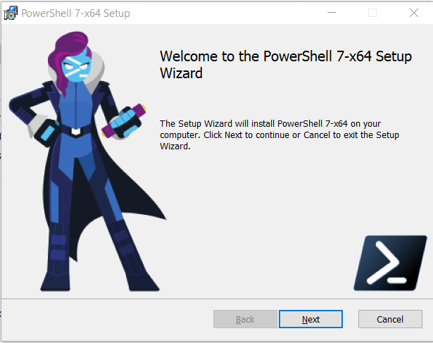
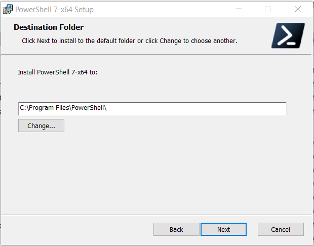
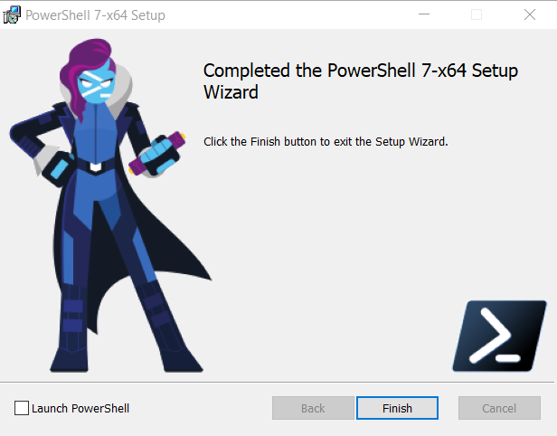

# Getting Started on Windows 10  

## Windows Install  

1. Uninstalled all preview versions and v6
2. run the .msi from [PowerShell Github](https://github.com/PowerShell/PowerShell/releases/tag/v7.0.0)  
3. Click `next` on the welcome screen.  
  
4. You can change the destination if you wish.  I just left the defaults and clicked `next`.  
  
5. On the optional actions screen I made sure there was a check in each box.  Then clicked `next`.  
  
6. Click `next` on the ready to install screen.
  
I personally love launching PowerShell after every install, so I put a check in the `Launch PowerShell` then clicked `Finish`.  
  
Now you have PowerShell 7 installed.  From here you can start customizing your environment.  Like change the background color, text color, and font size.  I also pin the application to my task bar.  
___

## Updating your IDE  

### VSCode  
I started off updating VSCode beause it is the IDE that I use most often.  

1. I started off looking at which version I was already running.  This can be found by opening up VSCode and selecting `Help -> About` then a box will open up like this:
  
2. I clcked on my `PowerShell Extenion` Icon and the extension was prompting me that it has already been updated.  
  
  

My assumption is that this worked because I never turned of telemety in [VSCode](https://code.visualstudio.com/docs/getstarted/telemetry)  

Beware, I did read a comment on [Twitter](https://twitter.com/deadlydog/status/1235755333399670786) where someone tryied to update VSCode before upgrading to PWSH-7 and it didn't work properly until they upgraded to PWSH-7.  

